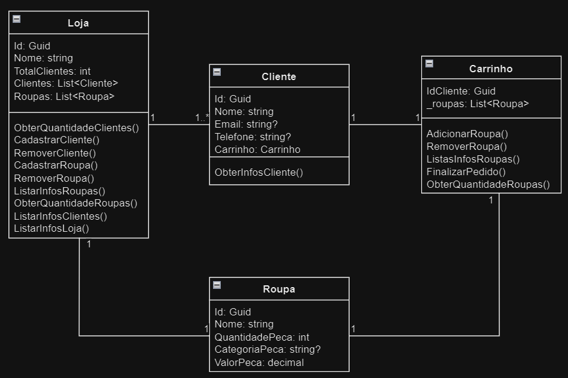

# Loja de Roupas

Repositório referente aos exercícios 1010 do Beecrowd:
https://judge.beecrowd.com/pt/problems/view/1010

Sobre o diagrama:

Loja - Possui um ID e um nome. Também é responsável por armazenar os produtos que estão alocados nela e os clientes que realizam compras.

Cliente - Possui um nome e um ID. Também tem algumas informações extras e um Carrinho para armazenar os produtos que deseja comprar.

Carrinho - Possui o ID do cliente e uma lista de produtos que o respectivo cliente deseja comprar.

Roupa - Possui um ID, um nome, a quantidade de peças disponíveis, a categoria e o preço unitário. O valor total da roupa é calculado através da multiplicação da quantidade pelo preço unitário.